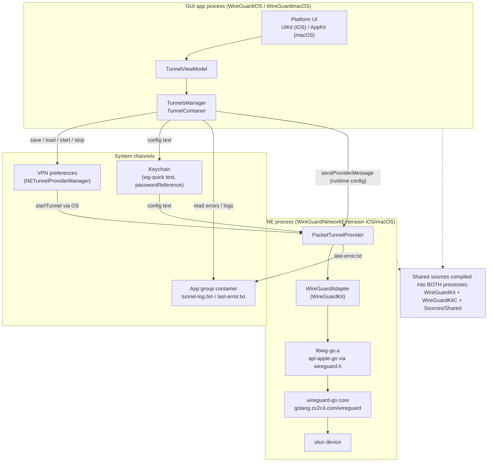
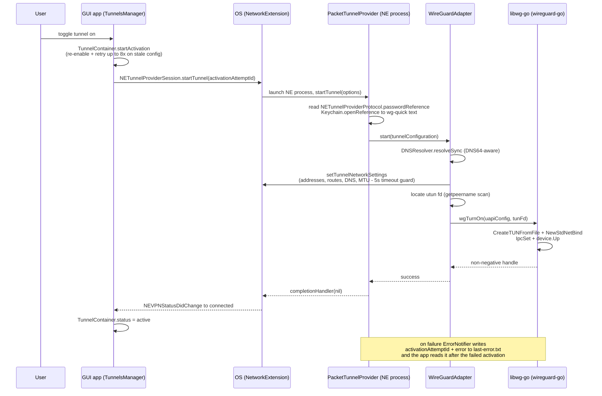
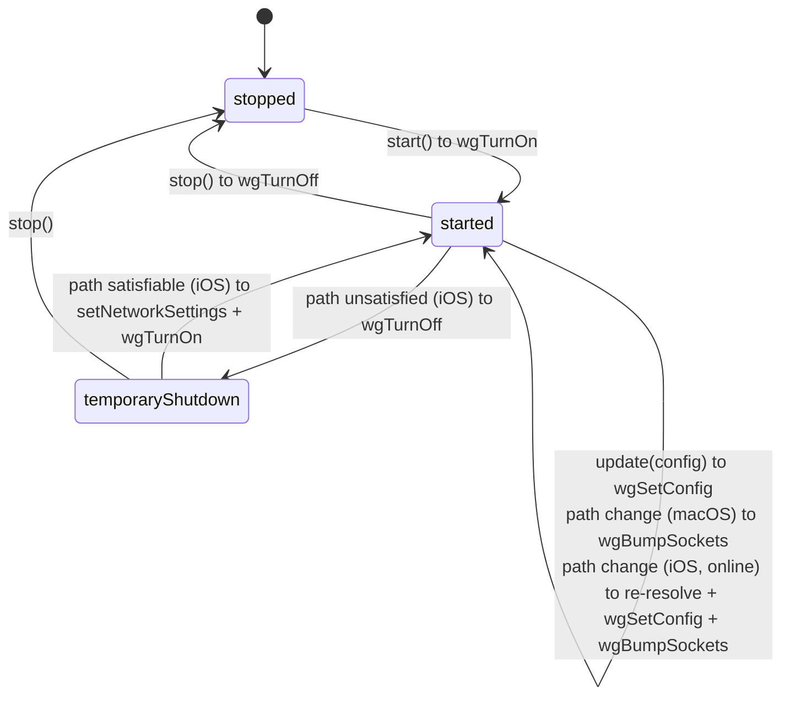
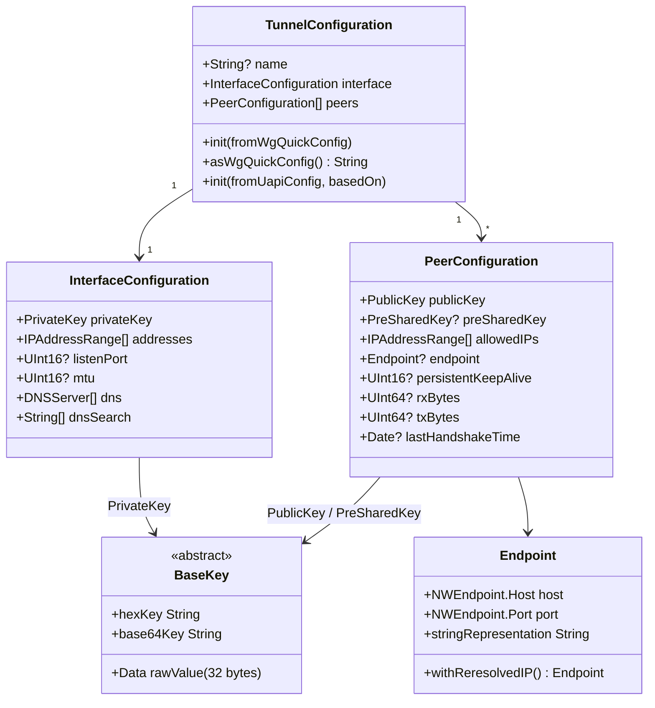
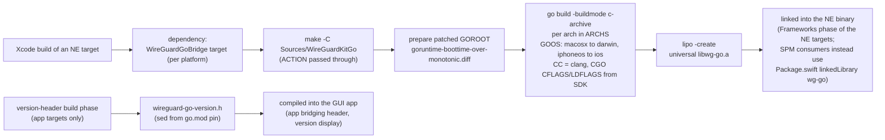

# wireguard-apple — Architecture

Companion to `PROJECT.md` (what things are); this document describes how the pieces fit and flow.

## 1. Processes, targets & dependencies

Two processes per platform: the **GUI app** and the **packet-tunnel Network Extension** (a separate
sandboxed process managed by the OS). They never call each other directly — they communicate through
the system VPN preferences, the Keychain, app-group container files, and provider messages.

Key structural facts:

- `WireGuardKit`, `WireGuardKitC`, and `Sources/Shared` are compiled **directly into** the app and
  NE targets (no framework product inside this project). `Package.swift` additionally exposes
  `WireGuardKit` as a Swift Package for external consumers.
- The NE targets depend on a **GoBridge legacy target** (`make` in `Sources/WireGuardKitGo`) and
  link the resulting universal `libwg-go.a`.
- The macOS app is a menu-bar app (`LSUIElement`) with a `LoginItemHelper` bundled for
  launch-at-login.

## 2. Tunnel activation flow

Deactivation: the app calls `stopTunnel()` on the session → `PacketTunnelProvider.stopTunnel` →
`adapter.stop()` → `wgTurnOff(handle)`; on macOS the NE process then calls `exit(0)` (documented
workaround for an Apple NE bug).

## 3. WireGuardAdapter state machine & network-path handling

All adapter work runs on a private serial `DispatchQueue`; an `NWPathMonitor` feeds path updates
into the same queue.

Platform divergences (deliberate, MUST be preserved):

| Concern | iOS | macOS |
|---|---|---|
| Path change while up | re-resolve endpoints, `wgSetConfig`, `wgBumpSockets`, `wgDisableSomeRoamingForBrokenMobileSemantics` | `wgBumpSockets` only |
| Offline | tear down to `temporaryShutdown`, restart when satisfiable | keep running |
| DNS re-resolution | `withReresolvedIP()` (DNS64 via `getaddrinfo`) | no-op |
| Default MTU | 1280 (`networkSettings.mtu`) | `tunnelOverheadBytes = 80` |

Not platform-divergent (applies on BOTH platforms, unconditionally): interface-address IPv6 network
prefixes are clamped to /120 in `PacketTunnelSettingsGenerator.addresses()` (the code comment
attributes the motivation to the iOS networking stack); allowed-IPs routes use the configured
prefix as-is.

## 4. Config data model & serialization surfaces

Three serialization surfaces, all of which MUST stay interoperable with standard WireGuard:

1. **wg-quick text** (`TunnelConfiguration+WgQuickConfig`, in `Sources/Shared`) — user-facing
   import/export and the Keychain-stored form. Interface keys: `PrivateKey`, `ListenPort`,
   `Address`, `DNS`, `MTU`; peer keys: `PublicKey`, `PresharedKey`, `AllowedIPs`, `Endpoint`,
   `PersistentKeepalive`. Unknown keys are parse errors (the macOS raw-text editor's
   `highlighter.c` enforces the same key set for syntax highlighting).
2. **UAPI generation** (`PacketTunnelSettingsGenerator`) — the `key=value` form passed to
   `wgTurnOn`/`wgSetConfig` (hex keys, resolved endpoints, `replace_peers`/`replace_allowed_ips`).
3. **UAPI readback** (`TunnelConfiguration+UapiConfig`) — parses `wgGetConfig` output (adds
   `rx_bytes`, `tx_bytes`, `last_handshake_time_*`, `protocol_version`) to show runtime stats.

Storage: the `NETunnelProviderManager` entry holds `providerBundleIdentifier`
(`<appId>.network-extension`), `passwordReference` (Keychain persistent ref to the wg-quick text),
on macOS the owning `UID`, and a display `serverAddress`. `TunnelsManager.create()` garbage-collects
keychain items not referenced by any manager and removes managers whose keychain reference no
longer verifies.

## 5. Go bridge build pipeline

The Makefile takes `ARCHS`, `PLATFORM_NAME`, `SDKROOT`, and the deployment-target flag from Xcode
(with standalone defaults: `macosx`, `x86_64 arm64`), so the same `make` works inside Xcode and from
the CLI. The boottime patch makes the Go runtime clock keep advancing across device sleep — without
it WireGuard timers misbehave after wake.

## 6. Logging & diagnostics

- `wg_log` writes to both `os_log` and a **ring-buffer log file** (`ringlogger.c`, memory-mapped)
  in the app group container — one file (`tunnel-log.bin`) shared by app (`APP` tag) and NE
  (`NET` tag). The Go core's logs flow through `wgSetLogger` into the same sink.
- `LogViewHelper` + the platform log views read/merge/export the ring buffer.
- NE activation failures reach the app via `last-error.txt` (activation attempt id + error code)
  in the app group container, because the OS reports only generic failure.

## 7. Where the WebSocket/wstunnel work will land (ROADMAP)

Per `PROJECT.md` (goal; execution pending discussion), the touch-points identified so far — kept
here so the map stays current:

| Layer | Touch-point |
|---|---|
| Go bridge | `go.mod` `replace` onto the sibling `wireguard-go` fork; build the multiplex (UDP + WebSocket) bind in `api-apple.go` instead of `conn.NewStdNetBind()`; Go toolchain/pin reconciliation in the `Makefile` |
| Config model | per-peer WebSocket surface on `PeerConfiguration` + `Endpoint` handling, byte-compatible with the sibling `wireguard-tools` fork |
| Serialization | `TunnelConfiguration+WgQuickConfig` (parse/serialize), `PacketTunnelSettingsGenerator` (UAPI), `TunnelConfiguration+UapiConfig` (readback), `highlighter.c` (macOS editor key set) |
| UI | `TunnelViewModel` peer fields + both platforms' editors |
| Parity | preserve the per-platform path-change semantics (§3) for WebSocket peers on BOTH platforms |
